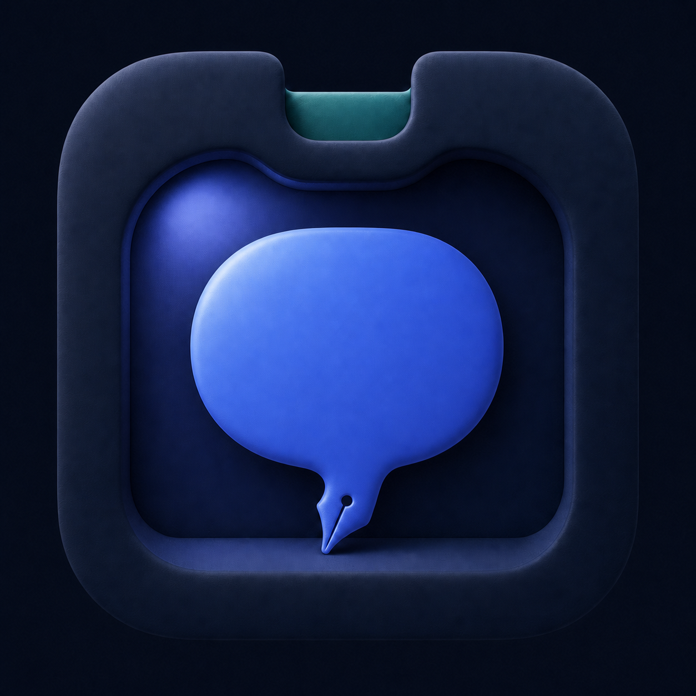

# Nook

**Meetings, tucked away.**

Nook is a native, local-first macOS meeting notebook. It lives in the menu bar,
captures system audio and your microphone only after you choose to record,
transcribes and summarizes on-device, and saves a portable Markdown note.



## Highlights

- Records system audio and microphone audio without inviting a meeting bot.
- Includes an explicit Settings check for microphone and meeting-audio levels,
  without recording or saving a test stream.
- Notices likely meetings across common native apps and browsers, then asks
  before recording.
- Produces live, speaker-aware captions using Apple's on-device Speech framework.
- Uses Apple's on-device Foundation Models framework when available, with a
  deterministic summary fallback.
- Saves summaries, decisions, action items, personal notes, and a timestamped
  transcript as ordinary Markdown.
- Dictates into any text field on the Mac: hold a shortcut, speak, and your
  words appear where you were already typing — verbatim, tidied, or rewritten
  as prose, all on-device.
- Includes a searchable native library, editable notes, raw Markdown editing,
  Shortcuts actions, and signed automatic updates.
- Supports VoiceOver, keyboard navigation, Reduce Motion, Reduce Transparency,
  Increased Contrast, and light/dark appearance.

## Requirements

- macOS 26 or later.
- A Mac supported by Apple's on-device Speech framework.
- Apple Intelligence enabled for generated summaries. Transcription and the
  deterministic summary fallback work without it.
- Stable Xcode 26 and XcodeGen 2.45.4 to regenerate and build the project.

The generated Xcode project is committed, so a contributor can start with:

```sh
open Nook.xcodeproj
```

Select the **Nook** scheme and press Run. Guided setup walks through:

1. Microphone access.
2. Speech Recognition access.
3. Screen & System Audio Recording access.
4. Direct screen and audio access without choosing a window for every meeting
   (described by macOS as bypassing the private window picker).

Changing Screen & System Audio Recording permission normally requires quitting
and reopening Nook. The direct-access check reads only shareable-content
metadata during setup; it does not start or save a test recording.

## Build and test

Install the pinned XcodeGen version, regenerate the project, and run tests:

```sh
xcodegen --version # expected: 2.45.4
xcodegen generate

xcodebuild test -quiet \
  -project Nook.xcodeproj \
  -scheme Nook \
  -destination 'platform=macOS' \
  -derivedDataPath .build/DerivedData \
  CODE_SIGNING_ALLOWED=NO
```

Contributor builds and tests do not require signing, notarization, GitHub, or
Sparkle credentials. `./Scripts/build-app.sh` creates a local app; it is not an
official release artifact.

## Privacy and consent

Nook has no application server in the meeting-data path. Meeting audio,
transcripts, notes, and summaries are processed on the Mac. The app can contact
Apple to install speech-language assets. Official builds can also contact GitHub
to check for signed updates; neither request contains meeting content.

Automatic meeting detection inspects local window titles, application identity,
and app audio activity. New users choose whether to enable it, and Nook always
asks before recording. Nook does not hide macOS recording indicators.

The Listening pane includes a Start Test control for checking microphone and
meeting audio levels before recording. The test is an in-memory meter only: it
does not record, save audio, transcribe speech, or send anything, and it stops
when Settings closes or a meeting or dictation session starts.
Normal macOS recording indicators still appear. A failed stop remains retryable;
new capture waits until the audio test has finished stopping.

Notes are stored as plaintext Markdown in `~/Documents/Nook` by default. The
folder can be changed in Settings. Temporary video containers are removed after
processing; extracted audio is retained only when **Keep extracted meeting
audio** is enabled.

Recording and transcription laws vary. You are responsible for obtaining
consent and following applicable law and workplace policy. See
[Privacy](docs/PRIVACY.md) for the complete data-flow and retention description.

## Download

The latest signed and notarized build is published in the separate
[Nook releases repository](https://github.com/wrnsnng/nook-releases/releases/latest).
Move `Nook.app` to `/Applications` before opening it so macOS permissions and
updates attach to a stable app location.

Every release publishes a `Nook.zip.sha256` beside the download. Nook is signed
with a Developer ID and notarized by Apple, so if macOS says it cannot verify
the app, compare the checksum before anything else:

```sh
shasum -a 256 Nook.zip
```

## Contributing

Issues and pull requests are welcome. Start with [CONTRIBUTING.md](CONTRIBUTING.md)
and follow the [Code of Conduct](CODE_OF_CONDUCT.md). Security vulnerabilities
should be reported privately as described in [SECURITY.md](SECURITY.md), not in
a public issue.

Working with an AI coding agent? [AGENTS.md](AGENTS.md) holds the rules this
codebase enforces, in one tool-agnostic file.

The most useful contributions include:

- reproducible fixes for meeting-detection false positives or misses;
- tests around capture, transcription, Markdown round-trips, and updates;
- accessibility improvements verified with macOS assistive settings;
- careful UI refinements that preserve Nook's quiet, native behavior; and
- documentation corrections based on observed behavior.

## Documentation

- [Product and UX contract](docs/PRODUCT.md)
- [Architecture overview](ARCHITECTURE.md)
- [Technical details](docs/TECHNICAL.md)
- [Privacy and data handling](docs/PRIVACY.md)
- [Accessibility](docs/ACCESSIBILITY.md)
- [Build and release operations](docs/OPERATIONS.md)
- [Project governance](GOVERNANCE.md)
- [Changelog](CHANGELOG.md)

## Project license

Nook's original source code, documentation, and project assets are licensed
under the [Apache License 2.0](LICENSE). The license does not grant permission
to use the Nook name, logo, app icon, or other source-identifying marks to brand
a modified distribution or imply endorsement; see the
[trademark policy](TRADEMARKS.md). Third-party materials remain under their
respective licenses; see [THIRD_PARTY_NOTICES.md](THIRD_PARTY_NOTICES.md).
