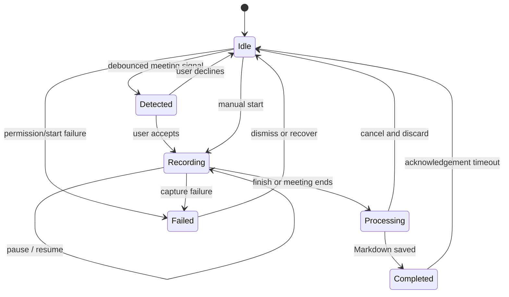

# Nook product and UX contract

## Product promise

Nook is a quiet, local-first meeting notebook for the Mac.

It notices likely meetings, asks before recording, keeps the live conversation
close to the camera, and turns the result into a portable Markdown note. It is
not another meeting window to manage and it is not a cloud meeting bot.

The short promise is:

> Meetings, tucked away.

## Audience

Nook is for people who spend time in calls across different meeting apps and
want a reliable personal record without inviting a bot, uploading company
conversations, or reorganising their workflow around a new service.

## Product principles

1. **Local by default.** Audio, transcripts, summaries, and notes remain on the
   Mac unless the user deliberately moves or shares them.
2. **Ask before capture.** Detection produces a prompt, never an automatic
   recording.
3. **Present, not intrusive.** The live surface belongs to the display edge and
   camera area. It should feel glanceable rather than like a floating dialog.
4. **Always recoverable.** A recording must always have an obvious route to
   pause, finish, expand, or restore—even after the top panel is hidden.
5. **Portable output.** Every completed meeting becomes understandable plain
   Markdown, not an opaque database record.
6. **System-native behavior.** Nook follows macOS appearance, accessibility,
   keyboard, permission, notification, and update conventions.

## Core capabilities

- Capture system audio and microphone audio independently of the meeting app.
- Detect likely meetings in Zoom, Microsoft Teams, Google Meet, FaceTime,
  Webex, Slack Huddles, Around, and Whereby.
- Prompt before starting a detected meeting.
- Optionally read the local calendar (opt-in) to name meetings after their
  event and to mention an upcoming one before it starts. Calendar reads stay
  on the Mac and recording still always asks first.
- Start a manual recording from the menu bar or `⇧⌘R`.
- Flag a moment while recording (`⌥⌘F`, panel button, or menu command) so it
  can be found in the note and, when audio is kept, played back from there.
- Ask a question across the whole library and get an answer drawn from your
  own notes, citing the meetings it used. Entirely on-device; weak matches
  are refused rather than guessed.
- Compile the week's meetings into one digest note with real counts,
  decisions, and highlights.
- Dictate formatting commands ("new paragraph", "new line") as exact
  substitutions, and keep a per-app dictation style for apps that need a
  different habit.
- Live-transcribe system audio and the user's microphone on-device.
- Show recent final lines plus the current partial phrase, keeping spoken
  context visible rather than replacing it too quickly.
- Pause and resume without capturing or transcribing the paused interval.
- Switch the live workspace between Transcript, Summary, and My notes.
- Refresh an on-the-fly summary of the conversation so far.
- Detach personal notes into a separate window.
- Finish a meeting from the top panel, menu-bar menu, app menu, or Dock menu.
- Cancel processing and discard an accidental recording.
- Produce a generated meeting title when the conversation contains enough
  signal, with a timestamp title only as fallback.
- Save the summary, structured outcomes, personal notes, and transcript into a
  local Markdown file.
- Browse, search, edit, reveal, and review saved meetings in the native library.
- Follow through on decisions: unfinished action items from every note are
  listed in the library, can be ticked off in place, and can be exported to
  Reminders on request.
- Dictate into any text field on the Mac with a customisable global shortcut.
- Receive signed and notarized updates through Sparkle.

## Dictation

Dictation extends the same promise — your voice, transcribed on this Mac — from
meetings to everything else typed on it. It is off by default and adds no
obligations for people who only want meeting notes.

The interaction is: hold a shortcut, speak, let go. Words appear in the field
that already has focus, as they are said. A small indicator follows the pointer
showing what Nook is currently hearing.

| Style | What reaches the field |
| --- | --- |
| Verbatim | Every word as spoken |
| Clean up *(default)* | The same words, minus hesitations and stutters |
| Polish | The same meaning, rewritten as prose |
| Custom | The same meaning, following the user's own instruction |

Three rules govern this surface:

1. **Only settled text is typed.** The recognizer revises its guess constantly.
   Revision is shown in Nook's indicator, where it costs nothing, and never in
   the user's document, where it would mean deleting characters they are
   watching.
2. **A rewrite is proposed, not trusted.** Dictated speech often reads as a
   request, and a language model will answer it. Every rewrite is checked
   against what was said; when it drifts, the spoken words are typed instead. A
   dictated question is written down, never answered.
3. **Failure degrades to the user's own words.** No model, no Apple
   Intelligence, a slow rewrite, or an app that refuses text insertion each cost
   polish — never the sentence.

Dictation is the only feature that asks for Accessibility access, and it asks
only when switched on.

## Primary surfaces

### Menu-bar item

Idle state uses the Nook quote-bubble mark. While recording it becomes an
unmistakable recording or pause symbol plus a fixed-width timer. The native menu
offers only commands that make sense for the current phase.

The menu clock is intentionally isolated from the menu's command model. AppKit
must not rebuild and move native menu items once per second while the pointer is
over them.

### Top panel

The top panel uses the physical screen edge and real MacBook camera safe area.
It never draws a fake notch.

| State | Purpose | Required recovery/control |
| --- | --- | --- |
| Idle confirmation | Briefly confirms Nook launched | Start recording |
| Meeting detected | Quiet consent prompt | Record or Not now |
| Expanded recording | Transcript, Summary, or My notes workspace | Pause, finish, collapse |
| Compact recording | Minimal waveform, timer, and transport | Expand, hide, pause, finish |
| Hidden recording | Small timer and recording dot beside the camera | Click to restore compact controls |
| Processing | Shows local post-processing progress | Cancel and discard while available |
| Completed | Confirms the Markdown note was saved | Open notes |
| Permission/error | Explains the exact recovery action | Retry, open settings, or dismiss |

On a MacBook with a camera housing, the hidden indicator anchors directly to
the camera's right edge. On an external display it becomes a small centered
screen-edge indicator. The hidden window is only as wide as the indicator so it
does not silently cover neighbouring menu-bar items.

### Meeting library

The library groups meetings by date and searches across titles, summaries,
structured outcomes, personal notes, transcript text, and metadata.

The detail surface has three views:

- **Notes:** summary, key points, decisions, action items, and editable personal
  notes.
- **Transcript:** speaker-aware, timestamped transcript.
- **Markdown:** editable source with explicit save/revert behavior.

## Meeting lifecycle

## Accessibility contract

- Every icon-only control has a specific accessibility label and help text.
- Expand, hide, pause, and finish are independent hit targets.
- Recording state and elapsed time are exposed without relying on color.
- Reduced Motion removes non-essential transforms and spring-like movement.
- Increased Contrast strengthens outlines and foreground separation.
- Auto, Light, and Dark appearance choices remain user-overridable.
- Notes placeholders and insertion points align consistently in every editor.
- Keyboard shortcuts remain available when the top panel is not visible.

The contributor acceptance checklist lives in [ACCESSIBILITY.md](ACCESSIBILITY.md).

## Voice and copy

Nook should sound calm, plain, and slightly warm. Prefer:

- “Tucking this conversation away”
- “Meeting saved”
- “Show meeting panel”
- “Stored locally in this Markdown file”

Avoid surveillance language, exaggerated AI claims, and overly celebratory
notification copy. Permission failures must name the exact macOS setting and
the next action.

## Privacy and consent

Nook never tries to hide macOS recording indicators. Users remain responsible
for consent, applicable recording laws, and workplace policy.

There is no Nook application server in the meeting data path. The release and
update infrastructure only distributes the app; it does not receive meeting
audio or notes.

The complete behavior and retention disclosure lives in [PRIVACY.md](PRIVACY.md).
