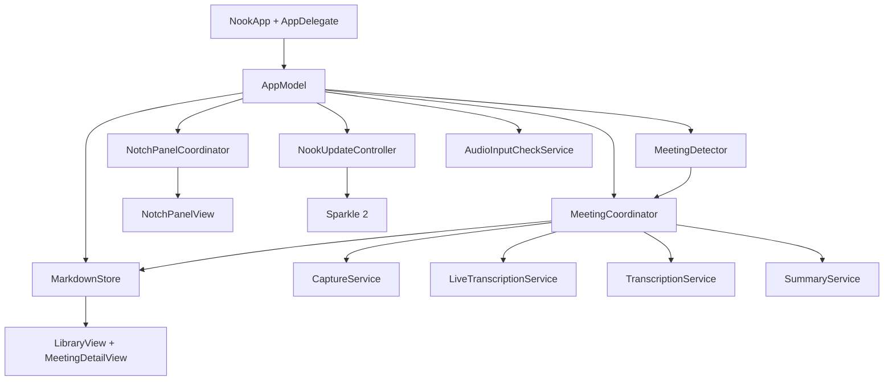

# Nook technical architecture

## Platform

- Native SwiftUI and AppKit macOS application.
- Minimum deployment target: macOS 26.
- Stable Xcode 26 / Swift 6 with strict concurrency.
- Bundle identifier: `com.localfirst.nook`.
- App Sandbox is disabled because ScreenCaptureKit system-audio capture and
  user-selected local storage do not fit the current sandbox model.
- Hardened Runtime is enabled for distribution.
- Contributor builds use `com.localfirst.nook.dev` and keep the production
  updater disabled. Maintainer distribution builds explicitly opt into
  `com.localfirst.nook` and the production updater.

## System overview



`AppModel` is the composition root. It owns the shared service instances and
connects meeting lifecycle callbacks to windows, the top panel, notifications,
and detached notes.

## Important components

### `MeetingCoordinator`

The central state machine for detection, recording, live transcript, pause,
processing, title generation, summary generation, notes, and recovery.

Published state drives every UI surface. Commands must be idempotent or guarded
against invalid phases because the same meeting can be controlled from several
surfaces.

### `CaptureService`

Uses ScreenCaptureKit to capture system audio and microphone audio. The visual
stream is a minimal 2×2 pixel, one-frame-per-second requirement of the capture
API; Nook does not retain useful screen video.

Temporary capture containers are deleted after processing. Extracted audio is
also removed unless the user enables **Keep extracted meeting audio**. Failure
cleanup reports any artifact that could not be removed.

### `AudioInputCheckService`

Owns the explicit Listening-pane input check. It creates a short-lived,
audio-only `SCStream` with `.audio` and `.microphone` outputs. It does not add
a recording output, set a file URL, or connect speech recognition, summaries,
recovery, event logging, or sleep assertions. Callback threads write the
latest bounded levels and monotonic timestamps under one mutex; one
main-actor polling task applies stale-level decay for the Settings meters.

`AppModel` rejects a start while a meeting or dictation capture is active and
stops the check when either feature becomes active. Stop owns a teardown
barrier, so a new check cannot start while ScreenCaptureKit is still winding
down. Input permission failures are shown in Settings and no sample leaves
the process.

### `LiveTranscriptionService`

Runs Apple's Speech recognizers on-device while capture is active. System audio
and microphone audio stay separate so the transcript can identify “Meeting”
and “You”.

`LiveTranscriptState` keeps final segments plus active partial text. The notch
caption stream presents up to five recent final lines, or four final lines plus
the current partial phrase.

### `TranscriptionService`

Performs a careful saved-audio pass when live speech recognition did not
complete reliably. This is a recovery/refinement path rather than a cloud
transcription service.

### `SummaryService`

Uses Apple's on-device Foundation Models framework when available and falls
back to deterministic extraction. The result is grounded against transcript
evidence before decisions and actions are saved.

### `MeetingDetector`

Polls visible application/window signals every four seconds.

- Provider profiles cover Teams, Zoom, Google Meet, Webex, FaceTime, Slack
  Huddles, Around, and Whereby. Native apps with ambiguous window titles must
  also have active audio; browsers always require meeting-specific title or
  domain evidence.
- Audio process matching includes a bounded parent-process walk so Safari
  WebKit and native helper processes resolve back to the meeting app.
- Two consecutive positive scans produce a detection.
- Five consecutive window misses end the signal.
- Core Audio process activity is a secondary end signal for apps such as Teams
  that can leave a meeting-titled window onscreen after the call has ended.
  Five consecutive inactive scans are required; the stale provider window then
  remains suppressed until its audio becomes active again.
- App/window patterns are intentionally conservative.

There is no universal meeting-state API on macOS. Detection can therefore miss
new or renamed meeting apps and must always have a manual fallback.

### `NotchPanelCoordinator`

Owns the borderless, non-activating `NSPanel`, targets the active display, and
anchors its frame to `NSScreen.frame.maxY` rather than `visibleFrame`.

It reads:

- `safeAreaInsets.top`
- `auxiliaryTopLeftArea`
- `auxiliaryTopRightArea`
- actual menu-bar height
- backing scale for pixel alignment

Normal resizes preserve the exact screen center. Hidden recording is a special
case: an 86-point window is positioned at the physical camera housing's right
edge. External displays center that same indicator.

### `StatusMenuState`

A deliberately low-frequency model for the native `MenuBarExtra`.

It observes phase, pause state, panel presentation, workspace mode, processing
capability, and recent notes. It does **not** observe elapsed time. The timer
lives in `NookMenuBarLabel`; isolating it prevents AppKit from moving menu items
under the pointer each second.

### `MarkdownStore`

Loads and saves portable meeting files. The default directory is
`~/Documents/Nook`, with an overridable folder in Settings.

Files include:

```markdown
---
id: UUID
kind: meeting
title: "Generated or user-edited title"
started: ISO-8601 timestamp
ended: ISO-8601 timestamp
source: "Teams / Zoom / Manual / …"
moments: 42.0,187.5
sessions: 2026-08-23T09:00:00Z/2026-08-23T09:20:00Z;2026-08-23T14:00:00Z/2026-08-23T14:10:00Z
audioStart: 1200.0
---

# Meeting title

## Summary
...

## Key points
- ...

## Decisions
- ...

## Action items
- [ ] ... [due: 2026-09-12]

## My notes
...

## Transcript
- **[00:12]** **Meeting:** ...
- **[00:18]** **You:** ...
- *(resumed 23 Aug 2026, 14:00)*
- **[00:00]** **Meeting:** ...
```

`kind` distinguishes a `meeting`, a `spoken` quick note, or a compiled `digest`;
a decoder that does not recognize a value falls back to `meeting`, so an older
file never fails to open. `moments` lists flagged offsets, in seconds. `sessions`
and `audioStart` exist only once a note has grown past one sitting: `sessions`
lists each recorded sitting as an ISO-8601 start/end pair, and `audioStart` is
where kept audio begins on the combined timeline when earlier audio was already
gone before a later sitting was appended. The `*(resumed ...)*` transcript line
is derived from `sessions` at encode time, not stored content, so a decoder is
free to ignore it, and Nook's own decoder does: it never becomes a
`TranscriptSegment`, so it appears in the saved file but not in the app's
transcript view. An action item's optional `[due: YYYY-MM-DD]` suffix is the
only place a due date lives; there is no separate frontmatter key for it.

Saving personal notes refreshes the raw Markdown draft so the Notes and
Markdown views cannot silently diverge.

Files are plaintext and the selected directory may participate in user-configured
backup or sync. See [PRIVACY.md](PRIVACY.md).

### `CalendarContextService`

Polls EventKit once a minute for events in a short horizon ahead of now, when
calendar context is switched on. It names a detected meeting after a nearby
event and fires one prompt per event shortly before it starts. Access is
requested only when the setting is enabled, and a denial or disabled state
looks identical to an empty calendar to every caller.

### `PrepBrief` / `PrepBriefController`

`SeriesMatcher` groups saved notes into a recurring series by normalized
title, since calendar frameworks expose no identifier stable enough to carry.
`PrepBriefBuilder` assembles a brief for the next occurrence entirely from
those notes, quoting their decisions, key points, and mentioned actions
rather than paraphrasing them, so no model sits in the path. `PrepBriefController`
owns the brief for whichever calendar event is currently approaching so the
library can show it without polling anything itself.

### `LibraryAnswerService`

Answers a question over the whole library on-device: passages are embedded
and ranked locally, the on-device model sees only the passages that matched,
and its answer must cite them by number. Anything that looks invented is
stripped before the user sees it, and a weak match is refused outright rather
than answered confidently.

### `DigestBuilder`

Compiles the last seven days of meetings into one deterministic note:
real counts, decisions deduplicated across meetings, up to two highlights per
meeting, and flagged-moment totals. It accepts an optional on-device overview
paragraph provider, but nothing in the app currently supplies one, so every
digest in practice is the deterministic facts alone.

### `OpenActionsController`

Aggregates unfinished action items across every note for the library's Open
actions sidebar. Checkbox state and due dates are not part of the decoded
model, so items are read straight from each file, and toggling one rewrites
exactly that line through the codec.

### `MomentHotKeyController`

The system-wide "flag this moment" hotkey, active only while recording.
Registered with Carbon's `RegisterEventHotKey` for the same reason dictation
uses it: the keystroke is consumed globally and needs no Accessibility
permission.

### `AudioRetention`

Optional, off-by-default sweep that moves kept extracted audio older than a
chosen window to the Trash on launch. Notes are never touched; a locked or
otherwise unremovable file is skipped rather than treated as a failure of the
rest of the sweep.

### `NoteCombiner` / `NoteSessionAppend`

Both ways a note grows past one sitting, recording into an existing note and
merging two saved notes, funnel through `NoteSessionAppend` so the rules stay
identical: one continuous transcript timeline, moments that stay valid
against kept audio, and personal notes that are never rewritten.
`NoteCombiner` additionally decides which of the two merged notes keeps its
identity (whichever started first) and how their kept audio combines,
returning a deferred `commitAudio` step so a Markdown-save failure leaves both
original notes and recordings untouched.

### `NoteDecodeCache`

A decode cache keyed by each file's modification date. Every app activation
used to re-read and re-decode every Markdown file, even when nothing on disk
had changed; entries now survive only while their file's timestamp matches,
so an edit through any route invalidates itself automatically.

### `RecordingRecovery`

Finds recordings left in the recordings folder with no note to show for
them, which happens whenever processing could not finish. The audio is kept
deliberately, since at that point it is the only copy of the conversation;
this service is what lets Settings turn one into a note or delete it instead
of it sitting on disk unnoticed.

## Permissions

Nook may require:

1. Microphone
2. Speech Recognition
3. Screen & System Audio Recording
4. Direct ScreenCaptureKit access without the per-meeting private window picker
5. Calendars (opt-in, requested when "Use my calendar for meeting context" is
   switched on; a full-access grant, since EventKit offers no narrower scope
   for reading event details, though Nook only ever reads)
6. Reminders (requested at the moment an action item is exported)

The final two macOS consent layers are completed together in guided setup.
Setup verifies direct access by fetching shareable-content metadata without
starting or saving a capture. Screen & System Audio Recording changes normally
require an app relaunch. Nook persists a pending start request and resumes it
after relaunch.

TCC grants attach to an application's designated code requirement. Distribution
builds must keep the stable bundle identifier and Developer ID identity.
Ad-hoc builds change their requirement with each binary and appear to “lose”
permission after rebuilding.

## Windows and activation policy

Nook normally runs as an accessory/menu-bar app. It promotes itself to a regular
windowed application when opening the library, introduction, or other primary
windows.

Auxiliary windows:

- Library
- Welcome/introduction
- Detached My notes
- Settings
- Quick note pad

Detached notes close when recording stops or leaves the recording phase.

## Appearance and brand

- Appearance choices: Auto, Light, Dark.
- The camera-attached top panel is always edge-black because the physical bezel
  is its material, independent of app appearance.
- The current app icon source is
  `Nook/Resources/Brand/NookIconSource-Cobalt.png`.
- `AppDelegate` sets the packaged cobalt master explicitly to avoid stale
  Launch Services/Dock artwork after an update.

## Tests and audit hooks

`NookTests` covers Markdown round-trips, notes persistence, title generation,
summary grounding, transcript assembly, permission routes, panel state,
status-menu state, search, storage collisions, and update configuration, plus
calendar context, prep briefs, weekly digests, multi-session append and
merge, note-combining, action item due dates, quick capture task parsing,
"ask your library" retrieval, recording recovery, dictation output guarding
and settings, and interface copy rules.

Debug-only launch arguments provide deterministic states for visual and
accessibility audits:

- `--audit-live`
- `--audit-summary`
- `--audit-notes`
- `--audit-detected`
- `--audit-processing`
- `--audit-completed`
- `--audit-failure`
- `--audit-library`
- `--audit-welcome`
- `--audit-dark`

These preview states must never start real capture or write meeting files.
