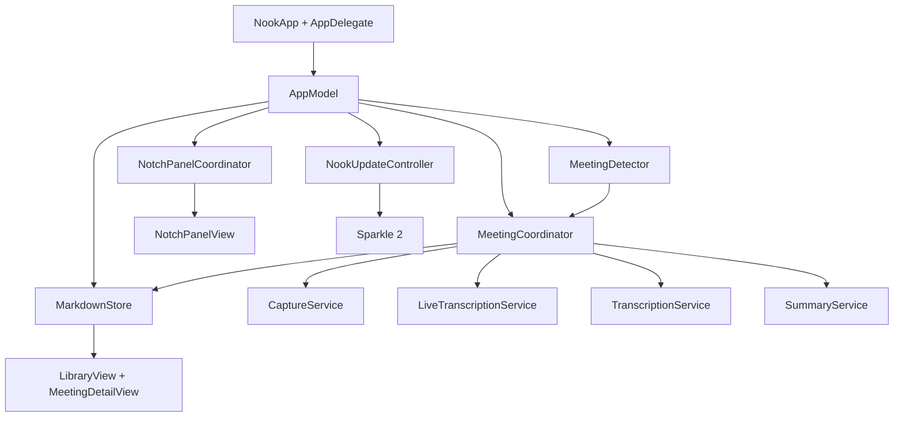

# Nook technical architecture

## Platform

- Native SwiftUI and AppKit macOS application.
- Minimum deployment target: macOS 26.
- Xcode 27 / Swift 6 with strict concurrency.
- Bundle identifier: `com.localfirst.nook`.
- App Sandbox is disabled because ScreenCaptureKit system-audio capture and
  user-selected local storage do not fit the current sandbox model.
- Hardened Runtime is enabled for distribution.

## System overview



`AppModel` is the composition root. It owns the shared service instances and
connects meeting lifecycle callbacks to windows, the top panel, notifications,
and detached notes.

## Important components

### `MeetingCoordinator`

The central state machine for detection, recording, live transcript, pause,
processing, title generation, summary generation, notes, and recovery.

Published state drives every UI surface. Commands must be idempotent or guarded
against invalid phases because the same meeting can be controlled from several
surfaces.

### `CaptureService`

Uses ScreenCaptureKit to capture system audio and microphone audio. The visual
stream is a minimal 2×2 pixel, one-frame-per-second requirement of the capture
API; Nook does not retain useful screen video.

Temporary capture containers are deleted after audio extraction. Extracted
audio is also removed unless the user enables **Keep extracted meeting audio**.

### `LiveTranscriptionService`

Runs Apple's Speech recognizers on-device while capture is active. System audio
and microphone audio stay separate so the transcript can identify “Meeting”
and “You”.

`LiveTranscriptState` keeps final segments plus active partial text. The notch
caption stream presents up to five recent final lines, or four final lines plus
the current partial phrase.

### `TranscriptionService`

Performs a careful saved-audio pass when live speech recognition did not
complete reliably. This is a recovery/refinement path rather than a cloud
transcription service.

### `SummaryService`

Uses Apple's on-device Foundation Models framework when available and falls
back to deterministic extraction. The result is grounded against transcript
evidence before decisions and actions are saved.

### `MeetingDetector`

Polls visible application/window signals every four seconds.

- Provider profiles cover Teams, Zoom, Google Meet, Webex, FaceTime, Slack
  Huddles, Around, and Whereby. Native apps with ambiguous window titles must
  also have active audio; browsers always require meeting-specific title or
  domain evidence.
- Audio process matching includes a bounded parent-process walk so Safari
  WebKit and native helper processes resolve back to the meeting app.
- Two consecutive positive scans produce a detection.
- Five consecutive window misses end the signal.
- Core Audio process activity is a secondary end signal for apps such as Teams
  that can leave a meeting-titled window onscreen after the call has ended.
  Five consecutive inactive scans are required; the stale provider window then
  remains suppressed until its audio becomes active again.
- App/window patterns are intentionally conservative.

There is no universal meeting-state API on macOS. Detection can therefore miss
new or renamed meeting apps and must always have a manual fallback.

### `NotchPanelCoordinator`

Owns the borderless, non-activating `NSPanel`, targets the active display, and
anchors its frame to `NSScreen.frame.maxY` rather than `visibleFrame`.

It reads:

- `safeAreaInsets.top`
- `auxiliaryTopLeftArea`
- `auxiliaryTopRightArea`
- actual menu-bar height
- backing scale for pixel alignment

Normal resizes preserve the exact screen center. Hidden recording is a special
case: an 86-point window is positioned at the physical camera housing's right
edge. External displays center that same indicator.

### `StatusMenuState`

A deliberately low-frequency model for the native `MenuBarExtra`.

It observes phase, pause state, panel presentation, workspace mode, processing
capability, and recent notes. It does **not** observe elapsed time. The timer
lives in `NookMenuBarLabel`; isolating it prevents AppKit from moving menu items
under the pointer each second.

### `MarkdownStore`

Loads and saves portable meeting files. The default directory is
`~/Documents/Nook`, with an overridable folder in Settings.

Files include:

```markdown
---
id: UUID
title: "Generated or user-edited title"
started: ISO-8601 timestamp
ended: ISO-8601 timestamp
source: "Teams / Zoom / Manual / …"
---

# Meeting title

## Summary
...

## Key points
- ...

## Decisions
- ...

## Action items
- [ ] ...

## My notes
...

## Transcript
**Meeting · 00:12** ...
**You · 00:18** ...
```

Saving personal notes refreshes the raw Markdown draft so the Notes and
Markdown views cannot silently diverge.

## Permissions

Nook may require:

1. Microphone
2. Speech Recognition
3. Screen & System Audio Recording

Screen & System Audio Recording changes normally require an app relaunch. Nook
persists a pending start request and resumes it after relaunch.

TCC grants attach to an application's designated code requirement. Distribution
builds must keep the stable bundle identifier and Developer ID identity.
Ad-hoc builds change their requirement with each binary and appear to “lose”
permission after rebuilding.

## Windows and activation policy

Nook normally runs as an accessory/menu-bar app. It promotes itself to a regular
windowed application when opening the library, introduction, or other primary
windows.

Auxiliary windows:

- Library
- Welcome/introduction
- Detached My notes
- Settings

Detached notes close when recording stops or leaves the recording phase.

## Appearance and brand

- Appearance choices: Auto, Light, Dark.
- The camera-attached top panel is always edge-black because the physical bezel
  is its material, independent of app appearance.
- The current app icon source is
  `Nook/Resources/Brand/NookIconSource-Cobalt.png`.
- `AppDelegate` sets the packaged cobalt master explicitly to avoid stale
  Launch Services/Dock artwork after an update.

## Tests and audit hooks

`NookTests` covers Markdown round-trips, notes persistence, title generation,
summary grounding, transcript assembly, permission routes, panel state,
status-menu state, search, storage collisions, and update configuration.

Debug-only launch arguments provide deterministic states for visual and
accessibility audits:

- `--audit-live`
- `--audit-summary`
- `--audit-notes`
- `--audit-detected`
- `--audit-processing`
- `--audit-completed`
- `--audit-failure`
- `--audit-library`
- `--audit-welcome`
- `--audit-dark`

These preview states must never start real capture or write meeting files.
