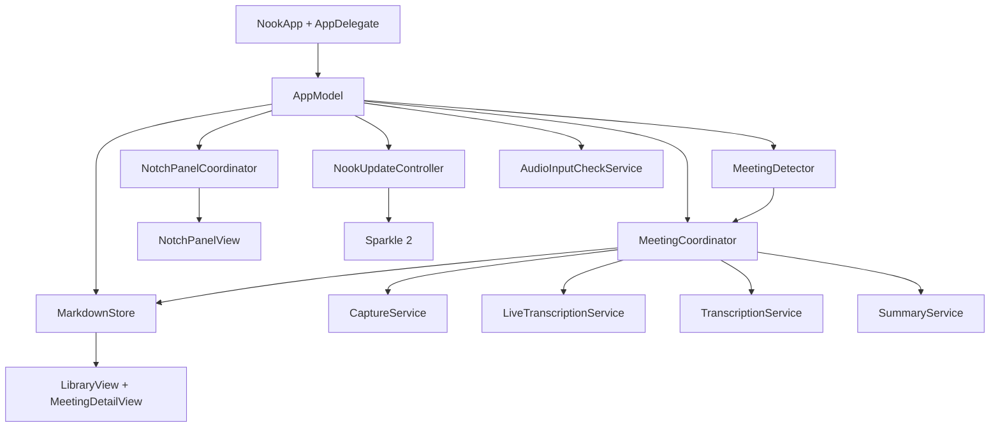

# Nook technical architecture

## Platform

- Native SwiftUI and AppKit macOS application.
- Minimum deployment target: macOS 26.
- Stable Xcode 27 / Swift 6 with strict concurrency.
- Bundle identifier: `com.localfirst.nook`.
- App Sandbox is disabled because ScreenCaptureKit system-audio capture and
  user-selected local storage do not fit the current sandbox model.
- Hardened Runtime is enabled for distribution.
- Contributor builds use `com.localfirst.nook.dev` and keep the production
  updater disabled. Maintainer distribution builds explicitly opt into
  `com.localfirst.nook` and the production updater.

## System overview

Command-palette fuzzy matching uses an off-main worker and the in-memory search
document cache. Cancellation checks between word comparisons prevent an obsolete
query from finishing a whole long transcript's fuzzy scan; already-ranked partial
hits are discarded. The controller separately rejects stale/cancelled worker
results. Normalization, tokenization and sorting remain synchronous passes, so
this is cooperative cancellation rather than a hard execution deadline.


```mermaid
flowchart TD
    App["NookApp + AppDelegate"] --> Model["AppModel"]
    Model --> Meeting["MeetingCoordinator"]
    Model --> Store["MarkdownStore"]
    Model --> Detector["MeetingDetector"]
    Model --> Panel["NotchPanelCoordinator"]
    Model --> Updates["NookUpdateController"]
    Model --> InputCheck["AudioInputCheckService"]

    Detector --> Meeting
    Meeting --> Capture["CaptureService"]
    Meeting --> LiveSpeech["LiveTranscriptionService"]
    Meeting --> Refine["TranscriptionService"]
    Meeting --> Summary["SummaryService"]
    Meeting --> Store

    Panel --> PanelView["NotchPanelView"]
    Store --> Library["LibraryView + MeetingDetailView"]
    Updates --> Sparkle["Sparkle 2"]
```

`AppModel` is the composition root. It owns the shared service instances and
connects meeting lifecycle callbacks to windows, the top panel, notifications,
and detached notes.

## Important components

### `VoiceCorrectionIntent` / `VoiceCorrectionProposal`

Complete Quick Note utterances can propose `scratch that` or `change the
previous item`, optionally with explicit replacement words. The former targets
only the immediately preceding unchanged dictated append; the latter targets
only the final nonempty line when it is an unambiguous Markdown list item.
Fence, continuation, blockquote and code-like contexts are not guessed. The
original list marker and checkbox state remain intact.

`QuickNoteController.receiveDictation` inserts recognized correction words
literally before offering a proposal. Applying requires the same proposal,
exact text, presentation and library generation. `TextViewInsertionPort`
refuses stale native text, disabled editing or marked-text composition, and
groups a confirmed replacement into native Undo/Redo. File writes still pass
through ordinary revision/conflict checks. A correction producing an empty
saved pad retains the existing explicit-discard requirement.

Review is an explicit capture pause, not an automatic recognition side effect.
Filing and review cannot overlap. Commands retain visible Review/Keep Words or
Undo controls even when privacy and save warnings occupy both status slots.
`DictationCoordinator` captures Quick Note ownership at run start, keeps late
results from cancelled runs out, and bypasses model refinement for runs with a
correction intent. Externally targeted speech never becomes a correction.
Injected focus, recognizer, audio, refinement and preferences enable synthetic
delivery tests without microphone access or real assistant calls.

### `MeetingCoordinator`

The central state machine for detection, recording, live transcript, pause,
processing, title generation, summary generation, notes, and recovery.

`AudioExtractor` assembles all audio tracks from each ordered capture part into
reusable composition lanes. It retains source assets while using their weakly
owned tracks, preserves offsets and silence, and applies equal per-part mixing
headroom. If video outlasts audio, a short silent PCM endpoint in the private
staging directory makes the M4A exporter retain the final gap; an empty edit and
explicit export time range alone do not. Lane order and stereo channels are not
speaker identity. Export uses
a private, same-volume staging directory; only a verified complete file can
replace the destination after file-identity checks. Failed or cancelled exports
leave source audio and the previous destination intact; cleanup failure is
reported even if a complete replacement has already succeeded. Metadata checks
narrow replacement races, but do not form a transaction against an uncooperative
external writer.

`SourceAudioFiles` selects a completed source companion for each ordered capture
part when its receipt and file identities remain valid, otherwise the original
ScreenCaptureKit file. Playback extraction and transcription use this same
selection and revalidate it across asynchronous work.
Recovery rebuilds playback whenever capture parts remain, even if no completed
source companion exists and an extracted M4A already exists. That cached mix
may predate a companion or a resumed primary-only part; it has no receipt tying
it to every current capture. Failed staged re-export preserves the cached audio
and original captures instead of saving a new source transcript beside obsolete playback and
then deleting its only complete sources. Legacy audio-only recovery still reuses
the surviving M4A.

`RecordedSourceTranscription` inspects the selected ordered capture files
before the mixed playback export is transcribed. A track can identify its input
only with one exact QuickTime information marker,
`nook:audio-source:v1:microphone` or `nook:audio-source:v1:system`. Track titles,
order, stereo channels, duplicate/conflicting markers and unknown versions are
not source evidence. If no track has a recognized marker, transcription uses
the existing mixed file. If any track is labelled, every audio track from every
part is isolated and transcribed serially, including unlabelled tracks as
Unattributed. Result timestamps include the track offset and preceding parts'
full durations. Identical words on two tracks are not deduplicated. Failed
transcription, invalid result timing, cancellation or changed input files reject
the result instead of returning a shortened transcript. The existing abandoning
deadline encloses this operation, including track export and Speech.

`SourceAudioRecording` is an auxiliary AAC writer fed by typed `.audio` and
`.microphone` ScreenCaptureKit callbacks. It keeps the original
`SCRecordingOutput` MP4 as fallback and writes explicitly marked tracks into
`<capture-stem>.sources/audio.mov`. AVFoundation state is confined to one serial
queue, with an 8 MiB retained-buffer budget and bounded encoder backpressure.
Initial packets share one timestamp epoch regardless of callback arrival order.
PCM packets straddling resume are copied from the first eligible frame in each
channel buffer; non-interleaved PCM cannot use CoreMedia's range-copy helper.
Intra-source gaps and final tails are filled with bounded native-format silent
PCM chunks because the AAC writer otherwise closes those timestamp gaps.

Pause records whether output removal actually succeeded, rather than inferring
it from a later waiter error. Successful removal seals the source queue; stop
also detaches it before finalization. Repeated finish calls share one boundary.
Cancellation, invalid packets, overflow or failed finalization leave the
companion ineligible and the original intact. After encoder completion, the
file is reopened to check the complete duration, exact source set, valid track
ranges and each source's expected final timestamp (with AAC-frame tolerance).
One full-length source cannot conceal a shortened second track. Only then is
`complete.json` published under the cancellation gate, after rechecking the
audio identity captured before the asynchronous validation. Cancellation or
cleanup during a delayed validation cannot recreate a receipt or package.
These container checks are not proof of audibility or SDK callback completeness.
Selection checks file identity,
size and modification/change times, not just playability. This receipt is a
local ownership check, not authenticated provenance or a portable format:
copying/replacing its files invalidates it. A valid companion remains
recoverable if only its original MP4 was removed. Partial packages remain
discoverable for Reveal/Delete. Recovery, artifact cleanup, retention and
storage accounting include these directories.

The auxiliary writer remains unmerged local work. Synthetic buffer/file tests
do not establish real callback completeness, physical pause/stop boundaries,
audio quality or sustained capture resource use; those acceptance checks remain.
The marker records an input route, not a person's identity and not authenticated
proof against someone deliberately editing recording metadata. Existing files
without that evidence remain Unattributed.

Published state drives every UI surface. Commands must be idempotent or guarded
against invalid phases because the same meeting can be controlled from several
surfaces.

Once a transcript-first note is saved, capture processing settles its recording
artifacts and completes without waiting for a summary. Recovery and partial
live-caption rescue use the same handoff. `MarkdownStore` owns
`NoteSummarySessions`, keyed by UUID plus file path, so the Library detail and
background writer share one cancellable request. Navigation does not cancel it.
Folder-generation changes, deletion and duplicate IDs invalidate it. A bounded
`SummaryRegenerationSession` rejects late callbacks, stale inputs and on-disk
revision conflicts; appended summaries retain existing tracked actions.
Cancelling its returned task also clears the running state and permits Retry.
Cleanup checks the request identity so an old task cannot clear a newer run.
All summary merge paths share exact transcript-input comparison: count, wording,
timing, duration and source must match; presentation-only segment UUIDs need not.
This keeps a valid initial/appended write-up from being silently discarded after
the session accepts the input and clears its pending marker.

`summary_status: pending` (or `pending-append`) is minimal durable state in the
ordinary Markdown file. The appended value selects the action-preserving merge
on Retry even after relaunch. The field is removed only when a successful
summary is committed. A failure,
cancellation or relaunch leaves saved words available with explicit Retry;
relaunch does not automatically restart enrichment. Progress and Retry appear
above every saved-note tab without replacing the existing prose. A partial
live-caption recording warning survives successful regeneration.

### `CaptureService`

Uses ScreenCaptureKit to capture system audio and microphone audio. The visual
stream is a minimal 2×2 pixel, one-frame-per-second requirement of the capture
API; Nook does not retain useful screen video.

Temporary capture containers are deleted after processing. Extracted audio is
also removed unless the user enables **Keep extracted meeting audio**. Failure
cleanup reports any artifact that could not be removed.

### `AudioInputCheckService`

Owns the explicit Listening-pane input check. It creates a short-lived,
audio-only `SCStream` with `.audio` and `.microphone` outputs. It does not add
a recording output, set a file URL, or connect speech recognition, summaries,
recovery, event logging, or sleep assertions. Callback threads write the
latest bounded levels and monotonic timestamps under one mutex; one
main-actor polling task applies stale-level decay for the Settings meters.

`AppModel` rejects a start while a meeting or dictation capture is active and
stops the check when either feature becomes active. Stop owns a teardown
barrier, so a new check cannot start while ScreenCaptureKit is still winding
down. Cancelled startup also retains a stream whose cleanup failed; meeting and
dictation startup require confirmed teardown before using audio. The injectable
`AudioInputCheckSession` exposes only start/stop, allowing lifecycle regression
tests without microphone, screen or speech permission requests. Input permission
failures link to the matching Settings pane and no sample leaves the process.

The candidate identity is recorded before awaiting native startup. A matching
terminal delegate callback remains recorded through the startup/cleanup barrier:
late startup success cannot publish a stopped stream, and a redundant cleanup
failure cannot restore its ownership. An explicit Stop still waits for that
barrier after an early failure. Direct cancellation of the returned startup task
also leaves no permanent Starting state. Callbacks from older identities do not
stop a newer session. A terminal callback during an explicit Stop is retained
until that stop returns: it prevents a later stop error from restoring the dead
stream, without releasing the competing-capture barrier early. That receipt is
cleared before another stop and cannot authorize a later failed teardown.
These are synthetic ordering guarantees, not a claim about
physical permission prompts or audio-device behavior.

### `LiveTranscriptionService`

Runs Apple's Speech recognizers on-device while capture is active. System audio
and microphone audio stay separate so the transcript can identify “Meeting”
and “You”.

`LiveTranscriptState` keeps final segments plus active partial text. The notch
caption stream presents up to five recent final lines, or four final lines plus
the current partial phrase.

### `TranscriptionService`

Performs a careful saved-audio pass when live speech recognition did not
complete reliably. This is a recovery/refinement path rather than a cloud
transcription service.

### `SpeakerDiarizationService` / `SpeakerAttribution`

The engine for on-device speaker separation (issue #28), in
`Nook/Services/Speakers/`.

`MeetingSpeakerSeparation.labelled` runs it during processing, after the
transcript is ready and before the note is first saved, because with audio
retention off the capture files are removed right after that save. It builds
one meeting-side file from every system-labelled track of every captured part
at its part offset (`MeetingSideAudio`), so a voice keeps one number across
pauses; separates it; attributes system passages by overlap; and writes
`Speaker N` onto `TranscriptSegment.speaker`. It is best effort: no labelled
system track, missing models, unreadable audio or any error leaves the
transcript unchanged, and the note is saved either way. Recordings joined to an
existing note are not separated, since new numbers would collide with names
the user already gave that note. `SpeakerNames` renames a speaker everywhere;
Markdown writes `**Name:**` beside lines and lists names in a `speakers:`
frontmatter array, and only listed names decode as speakers.

- `SpeakerDiarizationService.diarize(audioURL:)` returns `[SpeakerTurn]`
  (`start`, `end`, 0-based `speaker`, numbered by first appearance). It runs
  FluidAudio's offline pipeline: pyannote Community-1 powerset segmentation
  over 10 s windows stepped every 2 s, WeSpeaker embeddings, PLDA and VBx
  clustering, with the speaker count found automatically and non-overlapping
  output. It is a stateless `Sendable` struct; each call loads the models and
  releases them on return.
- `DiarizationAudio` reads the file with `AVAudioFile`, converts it with
  `AVAudioConverter` (channels mixed down, 16 kHz mono Float32) in 64k-frame
  chunks into a private temporary file, memory-maps it and unlinks it. Long
  recordings are therefore never materialized as one array; the pipeline
  copies one window at a time. Measured on an M4 Pro, 36 minutes of audio took
  12 s and raised peak memory by about 450 MB, largely independent of length.
- Errors are `SpeakerDiarizationError` (`modelsMissing`, `unreadableAudio`,
  `failed`). Cancellation surfaces as `CancellationError`; it is checked while
  converting and between analysis windows. Silence returns no turns.
- Engine output is not trusted: turns with non-finite or inverted times are
  dropped, the rest clamped to the audio, and speaker identifiers renumbered.
- `SpeakerAttribution.assign(segments:turns:audio:)` maps each attributable
  `TranscriptSegment` to the speaker with the greatest total time overlap.
  Microphone passages are never attributed. `.mixed` passages are attributed
  only when the turns came from the same mixed recording
  (`.mixedRecording`); against the remote-only system track (`.systemTrack`)
  a `.mixed` passage might be the user, so it stays unassigned. Passages with
  no overlap stay unassigned; ties go to the speaker already talking when the
  passage began, then the lower number.
  `renumberedByFirstAppearance(_:in:)` renumbers so labels count up in reading
  order.

No network path is reachable. The models are loaded with
`MLModel.load(contentsOf:)` from the bundle and passed to
`OfflineDiarizerManager.initialize(models:)`, so the manager never calls
`prepareModels()`, which is its only route to FluidAudio's `ModelHub`. The hub
is also put in `offlineMode` once, before FluidAudio is first used, so any
download path throws instead of fetching.

### `SummaryService`

Uses Apple's on-device Foundation Models framework when available and falls
back to deterministic extraction. The result is grounded against transcript
evidence before decisions and actions are saved.

Open questions travel through the typed and prose result schemas, first-pass
candidate ledger, validation, regeneration, append/recovery and Markdown. Their
ledger share stays inside the existing total prompt budget. Numeric/lexical
validation requires source wording and an explicit unresolved-status signal;
these conservative checks are not a proof of semantic entailment or that later
speech never answers a question. Actual-model and review acceptance must check
that distinction. Existing plain Open questions headings remain user-owned;
only the generated section's `<!-- nook:summary -->` marker gives it a modeled
field. Non-list text and repeated marked headings remain preserved extras.

`SummaryRecipe` is a fixed, explicit local selection carried through
`SummaryAttention`. General adds no recipe prompt. Saved selections survive
relaunch in `summary_recipe`, do not invoke generation and participate in the
stale-input check. Regeneration keeps the selected value. Merging uses the
surviving note's selection rather than guessing from the conversation or the
absorbed note; failed merging retains existing questions.

Generated sections are edited in place on the Notes tab. `SummaryEditsController`
(owned by `MarkdownStore`, so words outlive the detail view) holds the rows:
the gist a sentence or balanced paragraph per row, laid out exactly as the
read-only text was, and each list item a row. `InlineEditableText` is a
self-sizing TextKit 1 `NSTextView` per row that reports Return, Delete at the
start of a row and the arrow keys; `SummaryRowEditing` turns those into row
splits, joins and removals as pure functions. Rows remember the exact
separator before them, so rewording one sentence rewrites no other byte of the
summary. Saving is debounced, happens on focus loss, tab change, selection
change and quit, and goes through `MarkdownStore.updateGeneratedSections`: a
per-section three-way merge against the baseline the edit started from, a
Markdown round-trip rehearsal before writing and a read-back after. A section
changed elsewhere refuses the save and keeps the words. Action item completion
moves with the row, and a trailing `[due: ...]` suffix is kept out of the
editable words. A successful edit sets `summaryEditedByUser`
(`summary_edited: true`, meetings only); Regenerate and Retry confirm before
replacing edited sections, a confirmed regeneration clears the flag unless a
section typed into while it ran survives the merge, and recording into an
edited note keeps its sections and only adds new action items. Edits have no
crash-recovery journal entry; the debounce bounds what a crash can lose.

`SummaryProvenance` distinguishes retained transcript highlights, partial
extraction and edited fallback independently of `summaryPending`. The optional
`summary_origin` field is present only for meeting fallback content. Decode
recognizes exact legacy fallback output, including known failure reasons and
the partial-extraction notice, but not loose diagnostic mentions or modified
samples. Opening is read-only. Provenance follows the corresponding summary
field through optimistic merges: a successful model request does not clear
provenance attached to a newer user summary that was kept. Item correction
marks edited fallback and Undo restores the old origin. Diagnostic copy is not
an editable generated item. Failed note merging preserves earlier key points,
decisions, actions and questions and marks `pending-append` for a safe Retry;
success clears pending and fallback state. The saved-note fallback card stays
visible during progress and uses a native explicit Retry action.

`SummaryItemReviewSession` owns one explicit item review. Summary ranges are
derived with `NLTokenizer`; list references address an exact item snapshot.
Passages are exact UTF-16 ranges in current transcript segments and do not rely
on segment UUIDs surviving Markdown decode. Off-main retrieval ranks up to six
related passages with lexical overlap and local embeddings, retaining negative
statements rather than labeling matches as proof. Each passage is bounded to
900 characters. Feedback is bounded to 1,000 characters.

The native item-driven sheet owns source selection, transient feedback and
explicit Apply/Undo. It requests keyboard/accessibility focus at the first
passage and returns to the originating item, or the summary section after
removal/staleness. A typed on-device correction supplies a replacement and exact
quote. Existing grounding and numeric checks plus negation/uncertainty checks
reject unsupported proposals, but do not prove entailment. Deadlines and request
identities reject late results; changing feedback or source invalidates the
proposal. Apply/Undo recheck file revision, library generation and exact encoded
content. Action dates/completion and the incomplete-recording notice are not
model-editable. Undo is one-shot and refuses newer content. No review state is
persisted outside the explicitly saved item change.

### `MeetingDetector`

Polls visible application/window signals every four seconds.

- Provider profiles cover Teams, Zoom, Google Meet, Webex, FaceTime, Slack
  Huddles, Around, and Whereby. Native apps with ambiguous window titles must
  also have active audio; browsers always require meeting-specific title or
  domain evidence.
- Audio process matching includes a bounded parent-process walk so Safari
  WebKit and native helper processes resolve back to the meeting app.
- Two consecutive positive scans produce a detection.
- Five consecutive window misses end the signal.
- Core Audio process activity is a secondary end signal for apps such as Teams
  that can leave a meeting-titled window onscreen after the call has ended.
  Five consecutive inactive scans are required; the stale provider window then
  remains suppressed until its audio becomes active again.
- App/window patterns are intentionally conservative.

There is no universal meeting-state API on macOS. Detection can therefore miss
new or renamed meeting apps and must always have a manual fallback.

### `NotchPanelCoordinator`

Owns the borderless, non-activating `NSPanel`, targets the active display, and
anchors its frame to `NSScreen.frame.maxY` rather than `visibleFrame`.

It reads:

- `safeAreaInsets.top`
- `auxiliaryTopLeftArea`
- `auxiliaryTopRightArea`
- actual menu-bar height
- backing scale for pixel alignment

The window is a stage, not the shape. `NotchPanelMetrics.mode` names what the
island shows (prompt, ears, shelf, workspace, processing, saved, failed,
hidden) and `bodySize(for:)` sizes it. On a change the coordinator first grows
the window to cover both the old and new island, lets SwiftUI spring the
`NotchIslandShape` between them, and trims the window once
`NookMotion.morphSettleSeconds` has passed. Nothing animates the window frame,
so the shape and its content always move on one curve. `sizingOptions` is
empty so SwiftUI never resizes the stage itself.

Appearing grows the island out of the camera housing (`revealProgress` from 0
with `NookMotion.morph`); going away folds it back with `NookMotion.tuck`
while `isTucking` keeps the last content on screen. Compact recording wraps
the housing (waveform left, clock right) and hangs nothing below the menu
bar; hovering lowers a control shelf, and every shelf control is also a
VoiceOver action on the ears. Only floating states keep a transparent shadow
margin, because that margin still takes clicks.

Normal resizes preserve the exact screen center. Hidden recording is a special
case: an 86-point window is positioned at the physical camera housing's right
edge, reached by folding into the housing and reappearing beside it. External
displays center that same indicator.

Audio level, elapsed time and captions are read only by leaf views
(`IslandWaveform`, `VoiceRim`, `NotchRecordingClock`, `NotchCaptionStream`).
They smooth the 80 ms meter at up to 30 fps; the shell never observes it.

### `StatusMenuState`

A deliberately low-frequency model for the native `MenuBarExtra`.

It observes phase, pause state, panel presentation, workspace mode, processing
capability, and recent notes. It does **not** observe elapsed time. The timer
lives in `NookMenuBarLabel`; isolating it prevents AppKit from moving menu items
under the pointer each second.

### `MarkdownStore`

Loads and saves portable meeting files. The default directory is
`~/Documents/Nook`, with an overridable folder in Settings.

Layout inside the notes folder:

```text
Nook/                      the notes folder (Settings)
  2026-09-01_0900-planning.md
  Massimo/                 a folder: any visible directory one level down
    2026-09-02_1000-1-1.md
  .recordings/             kept audio and unfinished recordings (hidden)
```

Notes load from the notes folder itself and from each visible subdirectory
one level down (`LibraryFolders`). A folder *is* that directory: nothing else
records which folder a note belongs to, so folders made, renamed or removed in
Finder appear in the sidebar on the next reload, empty ones included. Hidden
directories, symbolic links, packages, Nook's reserved `.recordings` directory
and anything nested more than one level deep are never loaded. Kept audio stays
at the root in `.recordings` whichever folder its note is in.

Folder actions in the library change the disk directly. New Folder makes the
directory exclusively (`mkdir`), Rename renames it (`renamex_np` with
`RENAME_EXCL`; a case-only rename checks that both spellings are the same
directory first), and Delete moves each note back to the root and then removes
the directory only if nothing else is left in it (`rmdir`). Notes are never
deleted with a folder. Move To and drag and drop rename one note's file into
another directory with `RENAME_EXCL`, after the same changed-elsewhere check as
a save, and a taken filename gets the same ID suffixes as a new note. A note's
ID, bytes and revision are unchanged by a move; only its `LibraryNoteIdentity`
path changes. A move is refused while a summary write-up, an attaching
recording or an open Quick Note still writes to that file. Ownership checks
that used to require the notes folder as a file's direct parent
(`LibraryFolders.contains`) accept the root and its folders.

Files include:

```markdown
---
id: UUID
kind: meeting
title: "Generated or user-edited title"
started: ISO-8601 timestamp
ended: ISO-8601 timestamp
source: "Teams / Zoom / Manual / …"
moments: 42.0,187.5
sessions: 2026-08-23T09:00:00Z/2026-08-23T09:20:00Z;2026-08-23T14:00:00Z/2026-08-23T14:10:00Z
audioStart: 1200.0
---

# Meeting title

## Summary
...

## Key points
- ...

## Decisions
- ...

## Action items
- [ ] ... [due: 2026-09-12]

## My notes
...

## Transcript
- **[00:12]** **Meeting:** ...
- **[00:18]** **You:** ...
- *(resumed 23 Aug 2026, 14:00)*
- **[00:00]** **Meeting:** ...
```

`kind` distinguishes a `meeting`, a `spoken` quick note, or a compiled `digest`;
a decoder that does not recognize a value falls back to `meeting`, so an older
file never fails to open. `moments` lists flagged offsets, in seconds. `sessions`
and `audioStart` exist only once a note has grown past one sitting: `sessions`
lists each recorded sitting as an ISO-8601 start/end pair, and `audioStart` is
where kept audio begins on the combined timeline when earlier audio was already
gone before a later sitting was appended. The `*(resumed ...)*` transcript line
is derived from `sessions` at encode time, not stored content, so a decoder is
free to ignore it, and Nook's own decoder does: it never becomes a
`TranscriptSegment`, so it appears in the saved file but not in the app's
transcript view. An action item's optional `[due: YYYY-MM-DD]` suffix is the
only place a due date lives; there is no separate frontmatter key for it.

Saving personal notes refreshes the raw Markdown draft so the Notes and
Markdown views cannot silently diverge.

Files are plaintext and the selected directory may participate in user-configured
backup or sync. See [PRIVACY.md](PRIVACY.md).

### `CalendarContextService`

Polls EventKit once a minute for events in a short horizon ahead of now, when
calendar context is switched on. It names a detected meeting after a nearby
event and fires one prompt per event shortly before it starts. Access is
requested only when the setting is enabled, and a denial or disabled state
looks identical to an empty calendar to every caller.

### `PrepBrief` / `PrepBriefController`

`SeriesMatcher` groups saved notes into a recurring series by normalized
title, since calendar frameworks expose no identifier stable enough to carry.
`PrepBriefBuilder` assembles a brief for the next occurrence entirely from
those notes, quoting their decisions, key points, and mentioned actions
rather than paraphrasing them, so no model sits in the path. `PrepBriefController`
owns the brief for whichever calendar event is currently approaching so the
library can show it without polling anything itself.

### `LibraryAnswerService`

Answers a question over the whole library on-device: passages are embedded
and ranked locally, the on-device model sees only the passages that matched,
and its answer must cite them by number. Anything that looks invented is
stripped before the user sees it, and a weak match is refused outright rather
than answered confidently.

### `DigestBuilder`

Compiles the last seven days of meetings into one deterministic note:
real counts, decisions deduplicated across meetings, up to two highlights per
meeting, and flagged-moment totals. It accepts an optional on-device overview
paragraph provider, but nothing in the app currently supplies one, so every
digest in practice is the deterministic facts alone.

### `OpenActionsController`

Aggregates unfinished action items across every note for the library's Open
actions sidebar. Checkbox state and due dates are not part of the decoded
model, so items are read straight from each file, and toggling one rewrites
exactly that line through the codec.

Owners are read, never written: `ActionItemOwner` recognises `Name: task`,
`Name — task`, `@Name task` and `Name will task`, refusing labels such as
`TODO:` and pronouns. Rows show the owner beside the task; the file keeps its
own wording.

### `FollowUpDraft`

Builds a recap of a saved note for email or chat from the note's own
sections: the first summary paragraph, decisions, unfinished action items with
owners and due dates, and open questions. It is deterministic, so it works
without a model and cannot state more than the note does. `FollowUpDraftView`
shows it for editing; Open in Mail uses the system compose service, and Nook
never sends anything.

### `MomentHotKeyController`

System-wide meeting hotkeys (flag this moment, take a note), active only
while recording. Each instance has its own identifier and answers only its own
presses, because every handler on the application target sees every hotkey.
Registered with Carbon's `RegisterEventHotKey` for the same reason dictation
uses it: the keystroke is consumed globally and needs no Accessibility
permission.

### `AudioRetention`

Optional, off-by-default sweep that moves kept extracted audio older than a
chosen window to the Trash on launch. Notes are never touched; a locked or
otherwise unremovable file is skipped rather than treated as a failure of the
rest of the sweep.

### `NoteCombiner` / `NoteSessionAppend`

Both ways a note grows past one sitting, recording into an existing note and
merging two saved notes, funnel through `NoteSessionAppend` so the rules stay
identical: one continuous transcript timeline, moments that stay valid
against kept audio, and personal notes that are never rewritten.
`NoteCombiner` additionally decides which of the two merged notes keeps its
identity (whichever started first) and how their kept audio combines,
returning a deferred `commitAudio` step so a Markdown-save failure leaves both
original notes and recordings untouched.

### `NoteDecodeCache`

A decode cache keyed by canonical file path and SHA-256 content revision.
Reloads read exact bytes off the main actor and reuse parsed models only when
those bytes still match. This detects external edits that preserve modification
dates while avoiding repeated Markdown parsing and transcript cleanup.

Search documents and library rows use `LibraryNoteIdentity`, which combines
the stored UUID with its file path. Finder copies keep separate row identities
without changing their frontmatter. Conflicting UUIDs open a file-specific
read-only review; UUID-only links require an explicit choice. Recording,
summary, and action-item mutations retain their captured file owner across
asynchronous work. Duplicate groups are omitted from library-wide aggregation
with an explanation rather than silently counting one conversation twice.

### `RecordingRecovery`

Finds recordings left in the recordings folder with no note to show for
them, which happens whenever processing could not finish. The audio is kept
deliberately, since at that point it is the only copy of the conversation;
this service is what lets Settings turn one into a note or delete it instead
of it sitting on disk unnoticed.

### App Intents (`Nook/Intents`)

Shortcuts, Siri and Spotlight actions run in the app's own process through
the AppIntents framework; there is no extension target. Each action calls the
same coordinator method as its button (`startManualMeeting`, `stopRecording`,
`togglePause`, `flagMoment`, `requestNoteLine`, `QuickNoteController.present`),
so permission prompts and consent behave identically. The phase checks and
reply wording are pure functions (`RecordingIntentRules`, `TakeNoteRoute`,
`IntentLibrary`, `LibraryAskReply`) so they can be tested without a running
meeting, and an action that does not apply throws a `NookIntentError` with a
readable sentence instead of silently doing nothing. Ask Your Library reuses
`LibraryAnswerService`, and Get Open Action Items reuses
`OpenActionsController.refresh`, so neither duplicates retrieval or file
parsing. `MeetingEntity` exposes saved notes by their Markdown UUID with an
`EntityStringQuery` over titles that uses the library search's own term
matching. Intent type names are what saved Shortcuts refer to, so the actions
that predate this folder keep theirs. `NookShortcuts` offers ten App Shortcuts,
the system maximum.

### `MeetingSpotlightIndexer`

Mirrors saved meetings and quick notes into Core Spotlight under the domain
`meetings`, keyed by note UUID: title, summary as the description, key points
and decisions as keywords, and the start date. Digests, unsaved notes and
copies sharing a UUID are excluded. It observes `MarkdownStore.notes`,
`isLoading` (a loading library looks empty, so nothing syncs until it settles)
and the `showMeetingsInSpotlight` default. Changes are coalesced by a single
worker reading one `AsyncStream`, so a burst of saves costs one sync after a
two-second quiet period and syncs never overlap. Each sync fingerprints what
would be indexed per note and diffs it with a record of what Spotlight was
last sent (`Caches/<bundle-identifier>/Spotlight/indexed-notes.json`), so an
unchanged library sends nothing at launch, edits to transcripts or My notes
send nothing, and notes trashed while Nook was closed are removed. With no
record, it clears its items and rebuilds. Items are sent in batches of 500
with a distant expiration date, since Spotlight otherwise drops items a month
after indexing. Turning the setting off deletes every item and the record.

A Spotlight result arrives as a `CSSearchableItemActionType` user activity.
Both `AppDelegate.application(_:continue:restorationHandler:)` and the library
scene's `onContinueUserActivity` hand it to `MeetingSpotlightContinuation`,
which ignores a second delivery of the same activity and opens the note once
the library has loaded and the window actions are installed.

## Bundled speaker diarization models

`Scripts/fetch-diarization-models.sh` downloads the five offline-pipeline
artifacts (`Segmentation`, `FBank`, `Embedding` and `PldaRho` `.mlmodelc`
folders plus `plda-parameters.json`, about 21 MB) from
`FluidInference/speaker-diarization-coreml` at the revision FluidAudio 0.17.4
pins, checks every file against a SHA-256 in the script, and moves them into
the gitignored `ThirdParty/SpeakerDiarizationModels/`. It is idempotent: when
the folder already verifies, it does nothing. `--check [directory]` verifies
without any network access and also rejects unexpected extra files.

`project.yml` adds that folder to the Nook target as a folder reference, so the
generated project is identical whether or not the models have been fetched,
and runs `fetch-diarization-models.sh --check` as a pre-build script. A build
without the exact models fails with an error telling the developer to run the
script, so no build can quietly ship without speaker separation.
`Scripts/build-app.sh` and both CI workflows fetch before building, and
`Scripts/verify-release-app.sh` and CI re-verify the copy inside the built app.

## Permissions

Nook may require:

1. Microphone
2. Speech Recognition
3. Screen & System Audio Recording
4. Direct ScreenCaptureKit access without the per-meeting private window picker
5. Calendars (opt-in, requested when "Use my calendar for meeting context" is
   switched on; a full-access grant, since EventKit offers no narrower scope
   for reading event details, though Nook only ever reads)
6. Reminders (requested at the moment an action item is exported)

The final two macOS consent layers are completed together in guided setup.
Setup verifies direct access by fetching shareable-content metadata without
starting or saving a capture. Screen & System Audio Recording changes normally
require an app relaunch. Nook persists a pending start request and resumes it
after relaunch.

TCC grants attach to an application's designated code requirement. Distribution
builds must keep the stable bundle identifier and Developer ID identity.
Ad-hoc builds change their requirement with each binary and appear to “lose”
permission after rebuilding.

## Windows and activation policy

Nook normally runs as an accessory/menu-bar app. It promotes itself to a regular
windowed application when opening the library, introduction, or other primary
windows.

Auxiliary windows:

- Library
- Welcome/introduction
- Detached My notes
- Settings
- Quick note pad

Detached notes close when recording stops or leaves the recording phase.

## Appearance and brand

- Appearance choices: Auto, Light, Dark.
- The camera-attached top panel is always edge-black because the physical bezel
  is its material, independent of app appearance.
- Accent: lagoon teal. `NookPalette.accent` is the luminous value for text,
  icons and light on dark surfaces; `NookPalette.accentFill` is the fill behind
  white labels (system prominent buttons, switches) and matches
  `AccentColor`. Both hold AA in their roles and are pinned by
  `NookDesignContrastTests`.
- The current app icon source is
  `Nook/Resources/Brand/NookIconSource-Lagoon.png`, rendered with the app icon
  set by `Scripts/brand/render-icon.swift`.
- `AppDelegate` sets the packaged lagoon master explicitly to avoid stale
  Launch Services/Dock artwork after an update.

## Tests and audit hooks

`NookTests` covers Markdown round-trips, notes persistence, title generation,
summary grounding, transcript assembly, permission routes, panel state,
status-menu state, search, storage collisions, and update configuration, plus
calendar context, prep briefs, weekly digests, multi-session append and
merge, note-combining, action item due dates, quick capture task parsing,
"ask your library" retrieval, recording recovery, dictation output guarding
and settings, interface copy rules, and speaker attribution. The speaker
separation engine is exercised end to end against a checked-in synthetic
two-voice fixture (`NookTests/Fixtures`, made with macOS `say`), which requires
the bundled models and fails, rather than skips, if they are absent.
`Scripts/Tests` checks that the model check rejects missing, extra and altered
files.

Debug-only launch arguments provide deterministic states for visual and
accessibility audits:

- `--audit-live`
- `--audit-summary`
- `--audit-notes`
- `--audit-detected`
- `--audit-processing`
- `--audit-completed`
- `--audit-failure`
- `--audit-library`
- `--audit-welcome`
- `--audit-dark`

These preview states must never start real capture or write meeting files.
